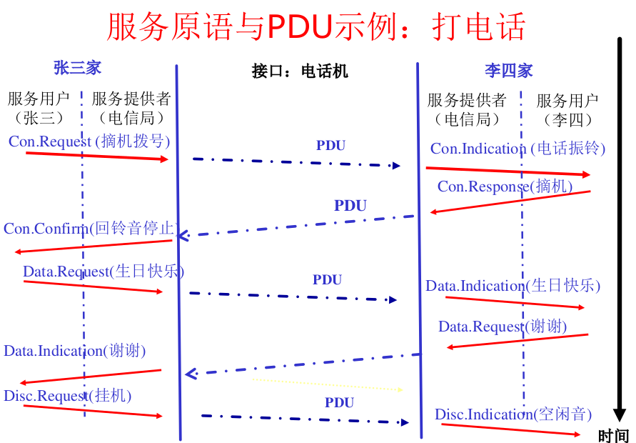

# 计算机网络课程笔记

## Schedule

教材 Computer Networks

| 项目 | 占比 |
| ---- | ---- |
| 课后 | 10   |
| 实验 | 25   |
| 期中 | 5    |
| 期末 | 60   |

实验：协议分析 10，协议设计及实现实验 15

**The reference model used in this book.**


## Chapter 1

### 小结

- 计算机网络的概念
  - 什么是计算机网络
    - 计算机网络 | 分布式系统
    - 计算机网络的应用
    - 计算机网络的目标：资源共享、信息传输
    - 应用的两种模式：C/S 模式 | P2P 模式
    - 通信服务质量 QoS: 时延、带宽和误码率
  - 计算机网络硬件组成
    - 节点（端节点、中间/交换节点）、链路
    - 有基础设施的网络 | 自组织网络 Ad hoc
- 计算机网络分类
  - 按传输技术分
    - 点到点链路 | 广播链路
    - 单播、广播与多播
  - 按覆盖范围分
    - PAN，LAN，MAN，WAN，互联网 internet
    - LAN: Ethernet(以太网)、WiFi
    - MAN：Cable TV, Wimax
    - WAN：通信子网、交换设备与路由交换技术
    - 互联网：网络的网络，路由器
  - 按位置分
    - 接入网 | 骨干网

---

### `What is a Computer Network?`

what can be connected  
how to connect? 直接 or 中转  
wired or wireless  
how far? LAN/WAN/Internet

**Communication**: process of transferring information from one entity to another.(wikipeida)  
 **Computer**: machine helping human beings to process information.

Distributed Systems ：A collection of independent computers appears to its users as a single coherent system（单一的系统）  
 Computer networks: A collection of autonomous(自主工作) computers interconnected by a single
technology

**Distributed System(分布式系统)**  
 A single model or paradigm that it presents to the users  
 Transparency(透明：不可见)  
 “The illusion that you have something as simple as a uniprocessor system.”  
 A well-known example：the World Wide Web,  
 everything looks like a document (Web page)

**What is a Computer Network**  
 Users are exposed to the actual machines  
 If the machines have different hardware and
different operating systems, that is fully visible to the users  
 **However**  
 Some networks or parts of them (e.g., name services) are also distributed systems  
 every distributed system relies on services provided by a computer network

Computer Network is **NOT**

- Internet, which is a network of networks, as well as the unique global network.
- WWW, which is a distributed system (or an application) running on
  top of Internet

---

### `What can we do with Computer Networks?`


**分时共用的思想** (important)

- business apps
  - resource sharing
  - client-server mode
  - communication medium among employees
    - email, VoIP(Voice over Internet Protocol), videoconferencing
    - Qos(Quality of service)  
       latency (or delay), jitter 延迟  
       bandwidth 带宽  
       bit-error-rate 错码率
  - electronic commerce
    - airlines, bookstores, shopping carts,,,
- home apps
  - Access to remote information  
     Web browsing
  - Person-to-person communication  
     Instant messaging (QQ), social networks
  - Interactive entertainment(交互式娱乐)  
     Game playing
  - Electronic commerce  
    Ubiquitous computing(普适计算)
  - peer-to-peer(P2P) model
- mobile network users
  
  - Combinations of wireless networks and mobile
    computing
  - m-commerce(移动商务)
  - Portable office(移动办公)
  - Vehicle communication: trucks, taxis, …, keeping in contact with each other and with home office
  - Meter reading (远程抄表，比如电/水表)
  - RFID(Radio-frequency identification)，可用于智能餐盘
  - Sensor networks
  - VANET(Vehicular ad hoc networks, 车载自组织网络)
- social issues
  - Politics, religion, sex
  - Eavesdropping (窃听)
  - Credit card
  - Unwanted communication (Spam, …)
  - Privacy
- compoments
  - Nodes  
    Computers/Hosts(主机)/End Systems  
    Switches/Routers (Nodes, 节点)
  - Communication Links (wired or wireless)

---

### `Categories of Computer Networks`

中心化网络/去中心化网络（比如 Ad hoc, 自组织网络）

Cool **end system**  
**Links**: twisted pair $\to$ coax $\to$ fiber  
**Network Interface**: Wireless NIC / Ethernet NIC  
**Router/Switch**: Router and LAN Switch

```txt
A wireless network interface controller (WNIC) is a network interface controller which connects to a wireless network, such as Wi-Fi, Bluetooth, or LTE (4G) or 5G rather than a wired network, such as an Ethernet network.
```

Computer Networks can be **categorized** in a number of ways

| a                                       | b                                                           |
| --------------------------------------- | ----------------------------------------------------------- |
| Transmission technology                 | Broadcast networks / Point-to-point networks (more complex) |
| Network scale                           | PAN, LAN, MAN, WAN                                          |
| Position in the interconnected networks | Access networks (接入网，比如手机接入基站) / Core networks  |

---

`BY Transmission technology`  
Broadcasting | Multicasting 区别（？查）


---

`BY Scale`


- LAN
  - LAN (Local Area Network) is a privately owned network
  - Connecting hosts to edge router
  - Sharing ONE communication link
  - Ethernet，Wifi
- Metropolitan Area Networks(城域网)
  - A metropolitan area network based on cable TV.
  - Topology: Tree
  - Wireless: WiMax
- WAN(广域网): LAN and Subnet
  - WAN: telecommunication network that covers a broad area
  - Providing connections from a LAN to the Internet
  - Wireless: 3G, 4G, 5G
  - Communication subnet
    - Switching elements (交换设备：Router)
    - Switch or router
    - Routing decisions: Routing algorithm
    - Message Path
    - Single-path |. Multi-path
    - Best route must be used
- Internetworks: internet（互联网）

  - internet: network of networks
  - Internet（因特网） is the unique world-wide internet

---

`BY Position in the interconnected networks`


### `Network architecture and protocols`

Layering Architecture  
 What is Protocol?  
 Protocol, service and interface

将庞大而复杂问题转化为若干较小的局部问题，采用分层的思想。

- Networks are organized as a **stack of layers** (层次栈)
  - Reduce design complexity，each one built upon the one below it
  - The purpose of each layer is to offer certain services to the higher layer while shielding those layers from the details of how the offered services are actually implemented (Encapsulating 封装)
- **Object-oriented** programming
  - A particular piece of software (or hardware) provides a service to its users, but keeps the details of its internal state and algorithms hidden from them

---


**`Protocol(协议)`**  
An agreement between the communicating parties on how communication is to proceed

**`Peers （对等实体）`**  
The entities comprising the `corresponding layers` on `different machines`  
The peers may be processes, hardware devices

**`Interface （接口）`**  
Defines which `primitive operations and services` the lower layer makes available to the upper one

**`Network architecture（网络体系结构）`**  
`A set of layers and protocols`  
`Neither` the details of the implementation `nor` the specification
of the interfaces is part of the architecture

**`Protocol Stack（协议栈）`**
A list of protocols used by a certain system

---

Here comes an example:


---

**`Virtual Communication of Layer 5 Peers`**

- `Layer 5`  
  A message, M, is produced by an application process and given to layer 4 for transmission

- `Layer 4`

  - Puts a header in front of the message to identify the message and passes the result to layer 3

  - ```txt
    Header: control information, such as sequence numbers
    (In some layers, headers can also contain sizes, times, and other control fields)
    ```

- `Layer 3`

  - A limit to the size of messages transmitted in the layer 3 protocol
  - `Break up` the incoming messages into smaller units (packets)
  - Put a layer 3 `header` to each packet
  - Decides which of the outgoing lines to use and
    passes the packets to layer 2

- `Layer 2`

  - Adds a header & trailer to each piece
    Gives the resulting unit to layer 1

- `Layer 1`
  - Physical transmission

---


---

`Review of Network Architecture: Q&As`

为什么要分层? 简化设计和实现，便于互连互通  
网络体系结构包括：分哪几层？每层的功能是什么？
有哪些协议？  
每一层的对等实体之间进行通信，通信要遵守协议
**只有最底层是实际通信，其它各层都是虚拟通信**  
数据流向(Information Flow)：U 形，发送系统自顶
向下，最底层实际传输数据，接收系统自底向上  
封装：某层实体在上一层交付的数据前面（可能也在
后面）**加上自己的控制信息**，构成**本层的数据包**  
这些控制信息是由**协议**定义的

---

`Design Issues for the Layers`

- Reliability
  - Error detection and error correction （差错检测和恢复）
  - Routing: to find a path through a netwrok （路由选择）
- Network evolution
  - Protocol layering: dividing the overall problem and hiding implementation details
  - Addressing or naming: identifying senders and receivers
  - Internetworking（网络互通性）
  - Scalability(可扩展性)
- Resource allocation
  - Statistical multiplexing（统计复用：按需分配）
  - Flow Control(流量控制): A fast sender may swamp a slow
    receiver with data
  - QoS 服务质量
- Security

---


| Services: Connection-oriented(面向连接) | . Connectionless(无连接) |
| :-------------------------------------: | :----------------------: |
|         reliable (acknowledged)         |        unreliable        |
|                 message                 |          packet          |
|       store-and-forward switching       |   cut-throughswitching   |

`Message sequences and byte stream`  
Message sequences preserves the messageboundaries  
In byte stream service, the connection simply a stream of bytes, with no message
boundaries.

Connection-oriented service: negotiation

---


---

`Service provider and service user`  
The entities in layer $n$ implement a service used by layer $n+1$, layer $n$ is called the services provider, layer $n+1$ is called service user

`SAP: Service Access Point (服务访问点)`  
Layer $n$ SAPs are the places where layer $n+1$ can access the services offered

---

**`Service Primitives(服务原语): Message Style`**

A service is `formally specified` by a set of primitives (operations) available to a user process to access the service

Example
| Type | Function |
| --------------------- | ----------------------------------------------- |
| CONNECT.request | request a connection to be established |
| CONNECT.indication | signal the called party |
| CONNECT.response | used by the called party to accept/reject calls |
| CONNECT.confirm | tell the caller whether the call was accepted |
| DATA.request | request that data be sent |
| DATA.indication | signal the arrival of data |
| DISCONNECT.request | request that a connection be released |
| DISCONNECT.indication | signal the peer about the request |

`Service Primitives: Example`




---

A Simple Connection-oriented Service  
If the protocol stack is located in the operating system, the primitives are normally system calls（系统调用）  
系统调用：由操作系统提供给用户的应用编程接口(API)

Five service primitives for implementing a simple connection-oriented service.


---

`Example of protocol and service`

场景：用户在自己的计算机上浏览北邮主页分为两步：  
1）用户输入域名www.bupt.edu.cn，DNS协议翻译为 IP 地址，下层由 UDP 提供无连接服务  
2）浏览器发送请求给 Web 服务器，服务器返回主页，下层由 TCP 提供面向连接的服务


---

**`Services vs. Protocols`**

`Service`
Defines what operations the layer is prepared to perform on behalf of its users, but it `says nothing` at all about `how` these operations are `implemented`  
Relates to an interface between two layers, with the lower layer being the service provider and the upper layer being the service user

`Protocol`  
`A set of rules` governing the `format and meaning` of the messages that are exchanged by the `peer entities`  
Entities use protocols `to implement their service definitions` **服务是通过协议实现的**

`PDU(Protocol Data Unit)`:
Information exchanged between two peers

Service and protocol are completely `decoupled` (解耦的)  
They are `free to change their protocols` if they do not change the service


---

In network architecture, each layer provides a certain function(**services**) to its upper layer through interfaces.


## Chapter 2

## Chapter 3

## Chapter 4

## Chapter 5

## Chapter 6

## Chapter 7
