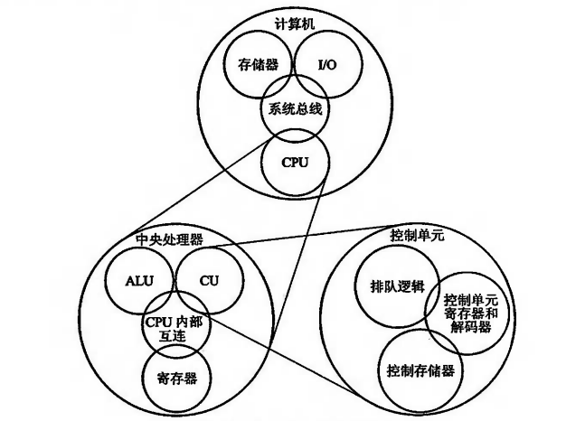

# 计算机组成原理

## 课程概述

| 成分     | 分值 |
| -------- | ---- |
| 硬件实验 | 20   |
| 期中考试 | 10   |
| 平时作业 | 10   |
| 期末考试 | 60   |

共 64 学时，48 课堂 + 16 实验

### 课程内容

- 计算机概述
  - 性能指标
  - 层次结构
- 数据表示与运算器
  - 数据的表示、运算器
  - 浮点运算方法
- 存储器
  - 层次化存储器系统的基本结构
  - SRAM、DRAM 存储器
  - Cache、虚拟存储器
- 指令系统
  - 指令集架构、寻址方式
  - 典型指令
- 中央处理器
  - CPU 模型、指令处理过程、微程序控制器
  - 硬布线控制器
- 总线
  - 总线分类、总线仲裁
  - 总线定时
- 外围设备
  - 磁盘、显示
- 输入输出系统
  - 程序查询、中断、DMA (Direct memory access)
  - 通道方式

### 实验内容

- 运算器组成
- 双端口存储器
- 数据通路
- 微程序控制器
- CPU 组成与机器指令的执行
- 中断原理

实验设备：TEC-8  
实验第四周开始

## 计算机系统概述

### 本章小结

- 计算机分类
- 冯诺依曼结构计算机
- 计算机性能指标
- 计算机组成
  - 软件
  - 硬件
- 计算机系统层次结构
- 软硬件逻辑等价性

`热点事件`

处理器内核的高危漏洞  
Meltdown 熔断  
Spectre 幽灵

攻击原理：乱序原理、推测执行（来源于硬件漏洞  
在一定条件下可以绕过内存访问的安全隔离获取隐私信息  
问题在于遇到异常时，并没有清理 cache 里的内容，于是黑客可以通过旁道攻击 Side Channel Attack 获取到敏感信息

### 计算机分类&历史

面向应用分类：

| 类别                                | 特点                                                                           |
| ----------------------------------- | ------------------------------------------------------------------------------ |
| 通用计算机                          | 具有计算机的标准形态，通过安装不同的应用软件，以相似的外观呈现并应用在各行各业 |
| 专用计算机 / 嵌入式 Embedded 计算机 | 安装或嵌入到交通工具、仪器仪表、控制系统、通信设备和家电产品等中的模块化计算机 |

通用计算机分类：

---

计算机发展历史

| 代数        | 名称                 | 时间      | 特点                                         |
| ----------- | -------------------- | --------- | -------------------------------------------- |
| 第 0 代     | 机械时代             | BC-1940   |                                              |
| 第 1 代     | 电子管时代           | 1943-1959 | 耗电高，体积大，定点计算，机器语言，汇编语言 |
| 第 2 代     | 晶体管时代           | 1960-1968 | 变集中处理为分级处理，浮点运算、高级语言     |
| 第 3 代     | 集成电路时代         | 1969-1977 | 存储容量大，运算速度快，几十至几百万次 / 秒  |
| 第 4 代     | 超大规模集成电路时代 | 1978-now  |                                              |
| ~~第 5 代~~ |                      |           | 量子计算机、光计算机、生物计算机             |

世界上第一台计算机 ENIAC, 1946

### 冯诺依曼结构计算机

IAS machine 也称为 Von Neumann 机  
冯 · 诺依曼结构计算机  
现代计算机体系结构的鼻祖：五大功能部件

Von Neumann 机特点：
将程序和数据存储在同一个存储器中  
采用二进制数据：简化了存储器设计  
字长 40 位，存储器地址 12 位，指令长度 20 位  
只实现整数运算（任何有能力的数学家都能在头脑中记住小数点的位置，乐）

---

趣事：  
比尔盖茨曾在一个演讲中说到：假如 GM 的技术能象计算机技术那样发展，我们现在应该能用 25 美元买到一辆一加仑汽油跑 1000 英里的汽车  
GM 反驳道：如果 GM 发展的技术像微软那样，那么现在开的汽车会有以下特点：

1. 你的汽车可能毫无道理地每天抛锚两次
2. 有时候你的车在高速公路上莫名其妙地熄火，你必需 Accept，然后 Restart
3. 有时候你的车在左转弯时突然熄火，而且无法 Restart ，所以你必需 Reinstall 发动机  
   ...

### 计算机性能指标

摩尔定律：集成电路芯片中晶体管数量大体上每 2 年翻一番

---

计算机性能指标：

- `处理机字长：`  
  指处理机运算器中一次能够完成二进制数运算的位数。如 32 位、 64 位等
- `总线宽度：`  
  通常指处理器与存储器之间进行互连用于传送数据的信号线数
- `存储器容量：`  
  存储器中所有存储单元的总数。通常用 KB 、MB 、 GB 和 TB 表示。  
   其中 K=2^10 ， M=2^20 ， G=2^30 ， T=2^40  
   B 表示 Byte = 8 位
- `存储器带宽：`  
  单位时间内从存储器读出的字节数，一般用字节数 / 秒表示。
- `主频 / 时钟周期：`  
  CPU 的工作节拍受主时钟控制，主时钟的频率 f 称为 CPU 的主频。度量单位是 MHz 、 GHz  
  主频的倒数称为 `CPU 时钟周期` $T$ ， $T=1/f$ ，度量单位是 $\mu s$ 、 $ns$

- `吞吐量：`  
  表示单位时间内完成的任务数。也称为带宽
- `利用率：`  
  在给定的时间间隔内系统被实际使用的时间所占的比率，用百分比表示
- `响应时间：`  
  计算机完成某任务所需的总时间，包括硬盘访问、内存访问、 I/O 活动、操作系统开销和 CPU 执行时间。也称为执行时间
- `CPU 执行时间：`  
  执行某一任务在 CPU 上花费的时间。  
  进一步分为用户 CPU 时间（程序本身所花费的 CPU 时间）和系统 CPU 时间（为执行程序而花费在操作系统上的时间）
- `CPU 性能公式：`  
  Cycles per instruction  
  程序的 CPU 执行时间 = 指令数 × CPI × CPU 时钟周期长度
- `CPI （ Clock Cycles Per Instruction ）：`  
  表示每条指令执行所
  需要的时钟周期数，或每条指令执行所需的平均时钟周期数 CPI= 程序执行所需的 CPU 时钟周期总数 ÷ 程序的指令总数
- `MIPS ：`  
  每秒百万指令数  
  MIPS= （指令总数 / 程序执行时间） × $10^{-6}$
- `MFLOPS：`  
  每秒百万次浮点操作次数  
  MFLOPS= （程序中浮点运算次数 / 程序执行时间）×$10^{-6}$
- `TFLOPS：`  
  每秒万亿次浮点操作次数  
   TFLOPS= （程序中浮点运算次数 / 程序执行时间）×$10^{-6}$

**`时间是唯一对计算机性能进行测量的完整而可靠的指标只用一种因素去评价性能是危险的，仅使用一种因素（CPI、主频或MIPS）测量计算机性能是不可靠的`**

### 计算机组成

软件
硬件

### 计算机系统层次结构

### 软硬件逻辑等价性

## Book

### Other

直接执行机器语言的机器称为实际机器 $M_1$  
把具有翻译功能的汇编程序的计算机看作一台机器 $M_2$，称为虚拟机  
至此的缺陷：汇编语言没有通用性，是面向实际机器的语言。  
高级语言通用性较强，比如 FORTRAN、C 等。  
于是产生了虚拟机器 $M_3$，并可 $M_3\to M_1$ or $M_3\to M_2\to M_1$

翻译程序：将高级语言程序翻译成机器语言程序的程序  
翻译程序有两种，一种是编译程序，一种是解释程序。

- 编译程序：全部翻译，执行
- 解释程序：逐条翻译，执行，再翻译，再执行

机器 $M_1$ 向上延伸出各级虚拟机。向下可延伸出微程序机器 $M_0$，其是对 $M_1$ 的划分，解释并执行 $M_1$ 的每一条机器指令。
通常又称 $M_1$ 为传统机器， $M_0$ 为微程序机器。
