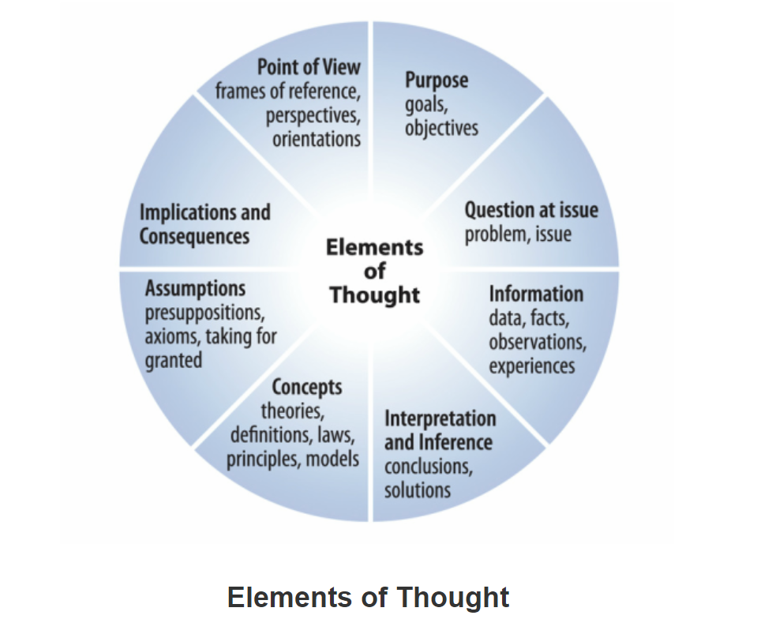

# Critical English Reading and Writing

## Cource Description

by 张晴

Firstly, she asked for our motivation for this course.

Then, she posed a question about the difference between reading and critical thinking.

```md
At first glance, I feel that, literally, I just need to figure out the meaning of the adjective "critical". Critical reading is just reading with critical thinking, so the problem comes down to explaining "reading with critical thinking". In my view, critical thinking guarantees my reading with question and challenges, as well as not believing in everything the author stated.
```

Reading is fundamentally a passive activity for many people.

We should notice that meaning doesn't happen automatically, that's called **self-awareness**

Then, the teacher introduced a reading theory.

(Revised) Bloom's Taxonomy -> different levels of thinking

[Taxonomy](https://www.etymonline.com/word/taxonomy#etymonline_v_7649) 是分类法的意思。


<!-- the most common -->

---

KWL (word map / semantic mapping)
[https://en.wikipedia.org/wiki/KWL_table](https://en.wikipedia.org/wiki/KWL_table)

```txt
A KWL table, or KWL chart, is a graphical organizer designed to help in learning. The letters KWL are an acronym, for what students, in the course of a lesson, already know, want to know, and ultimately learn. It is a part of the constructivist teaching method where students move away from what are considered traditional methods of teaching and learning...
```

- what I have known
- what I want to know: several questions
- what I learned

---

And accordingly, the teaching procedure is divided into 3 parts:

- `pre-reading`:  
  KWL, semanic mapping, brainstorming, predicting, skimming (略读)
- `during-reading`:  
  graphic representation, summarizing, inferring, analyzing, reading strategies, questions
- `after-reading`:  
  evaluating the purpose, (inference), implication, continuing the text, applying

---

Course scores:

|  evaluation stage   | score |
| :-----------------: | :---: |
|      presence       |   5   |
|  class performance  |  15   |
|    writing test     |  15   |
| writing assignments |  15   |
|        final        |  50   |

---

Lastly, she cited a picture from PISA (Programme for International Student Assessment) Reading framework process.


In this picture, the surface layer of reading is called `Text Processing`, which can be separated into `Locate information`, `Understand` as well as `Evaluate and Reflect`. And there is a deeper layer while reading, which is named `Task Mangement`. On this layer, the reader `Set Goals and Plans`, `Monitor and Regulate`.

```md
I can't agree more! While I'm reading, I always feel that there is an eye looking at my reading process, just like `Task Manager` in my computer.

When I'm feeling confused, `He` would remind me that perhaps my present status is not so good, or I have a lack on some basic knowledges, or I have mistaken the author's idea, and or perhaps I'm affected by some stereotypes, and I should figure them out...

yeah, perhaps these are just `Monitor`? I'm weak on `Regulate` and `Set Goals and Plans`.
```

OK, my status can't keep my reading, I just store the link here  
[How does PISA assess reading? | OECD iLibrary](https://www.oecd-ilibrary.org/how-does-pisa-assess-reading_8eebc6cc-en.pdf?itemId=%2Fcontent%2Fcomponent%2F8eebc6cc-en&mimeType=pdf#:~:text=The%20highest%2Dlevel%20process%20identified,of%20its%20content%20and%20form.)

---

The drawbacks in my class:

- After the class, I forgot what the student before my hand-raising said.
- In the class, I didn't raise my hand in the second class, while before the class, I think I should take more chances to improve my oral expression.

What I have learned:

- I've learned that thinking critically is not to criticize.
- I've gained a general impression on the reading theory.

---

Still some problems:

- I still think that when we are discussing the difference between the common reading and the critical reading, we should not include self-awareness as well as self-regulation. Perhaps in Chinese, "思辨" has the meaning of self-awareness... Well, I think the English name of the course should be like "how to read properly"? (laughing)
- Why the Bloom's taxonomy changes?  
  (just search on the Internet)

## Critical Thinking - an Introduction

What is critical thinking?  
analyze + infer + evaluate towards `your own thinking`  
by _Richiard Paul_ & _Linda Elder_

---

[Quotes](https://www.goodreads.com/quotes/1253168-everyone-thinks-it-is-our-nature-to-do-so-but#:~:text=%E2%80%9CEveryone%20thinks%3B%20it,Concepts%20and%20Tools):

```txt
“Everyone thinks; it is our nature to do so. But much of our thinking, left to itself, is biased, distorted, partial, uninformed or down-right prejudiced. Yet the quality of our life and that of what we produce, make, or build depends precisely on the quality of our thought. Shoddy thinking is costly, both in money and in quality of life. Excellence in thought, however, must be systematically cultivated.”
```

― _Richard Paul, Miniature Guide to Critical Thinking Concepts and Tools_

`Evolution:`

biased, distorted, partial, uninformed or down-right prejudiced  
$\to$ systematically cultivated excellence in thought

mindful/unmindful  
ill-informed<->well informed<->fully informed

---

`Q & A & my thoughts`  
Q: Does the quality of our life depends on the quality of our thoughts?  
A: Yes. Actions depend on thoughts, and the quality of our life directly depends on our actions. And the "denpends on" means that the thoughts acts as a key factor.  
I: Agree. Moreover, the quality of our life also directly depends on our evaluation of life, which is a part of our thoughts.  
Consider a homeless person; he may have a high quality of life in his view because he is chasing something meaningful and he doesn't feel dull. This case demonstrates how thoughts directly influence our quality of life. 可以认为是 `心境`？

Teacher: It's diffcult to be impartial because we are different individuals.  
I: Agree! And I think impartial is sometimes unnecessary.  
Partial is not good, but the stubborn pursuit of impartial may take us to the situation of losing our own judgements.

---

UNSOLVED: `HOW THINKING GENERATED`

---

`Critical thinking`, is to be **self-aware**:

- self-direted
- self-disciplined
- self-monitored
- self-corrective

which means to `consistently` attempt to be rationally, fair-mindedly (opposite to partial) and self-reflected

```txt
Rome wasn't built in a day
```

---

The levels of questions are corresponding to the levels of thinking (6).

Think with high-quality questions.and they can be suggestive, inferential, explanatory, conclusive...

AI?

no question? no understanding?

```txt
Like AI training, the basic task is to complete a sentence, or Cloze Test. That may come with the meaning that the buttom level of reading is remembering / asking basic questions.
```

standing back  
indentify analysis independent evaluating

not to be critical don't find claws  
more than that

discovery

---

`The Elements of Thought`


graph (like cooking)

- purpose  
  explicit/inplicit (how self aware)
- question at a issue
- information  
  include your own experiences
- interpretation and inference  
  -> to conclusions 例子：推销
- concepts  
  example: psychology theories  
  例子：personal relationships，还是推销员
- assumption  
  correct/incorrect  
  not necessary be sterotype  
  例子：北师大
- implications and consequences
  ```txt
  do this part out of thought?
  ```
- point of view

```txt
In my view, is this theory not so well-organized ???
```

---

KWL

| known                                                                 | want to know                         | learned |
| --------------------------------------------------------------------- | ------------------------------------ | ------- |
| excited?: movie:EVA Flipped singer:Talor... happy ending / bad ending | how love become an art?              |
| reference(from): father,mother,friends                                | what is love?                        |         |
| features: care, make us crying?, laughing,                            | different kinds of love?             |         |
| violent emotion experiences                                           | why we need love?                    |         |
|                                                                       | happy or pain?or painful art? SM?    |         |
|                                                                       | how to love?                         |         |
|                                                                       | importance of love? can I do without |         |

Then we read the first 2 paragraphs of _The Art of Loving_

```txt
KWL was not written in the correct way. I was confused about this and I asked my teacher after class.
According to her statements, the `known` can be just some words to open your mind, and after you finish your class, you'd add new words.
In other words, the `known` part represent a schema in your mind. But it should not contain too much message. For instance, some people wrote down `Titanic`, that's right, but what makes this film be related to `love`? Then the word `sacrifice` was written down.
You can also give some sentences, but they are not abstract enough.
```
