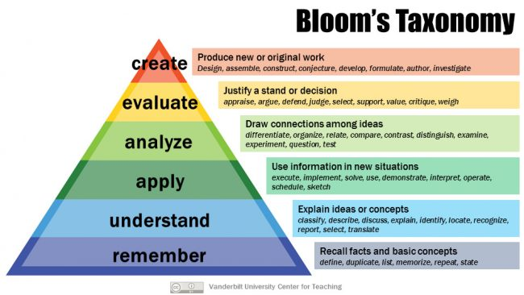
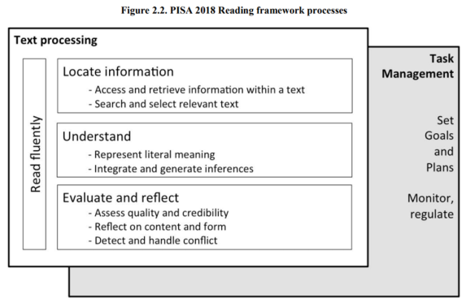

# Critical English Reading and Writing

## Cource Description

by 张晴

Firstly, she asked for our motivation for this course.

Then, she posed a question about the difference between reading and critical thinking.

```md
At first glance, I feel that, literally, I just need to figure out the meaning of the adjective "critical". Critical reading is just reading with critical thinking, so the problem comes down to explaining "reading with critical thinking". In my view, critical thinking guarantees my reading with question and challenges, as well as not believing in everything the author stated.
```

Reading is fundamentally a passive activity for many people.

We should notice that meaning doesn't happen automatically, that's called **self-awareness**

Then, the teacher introduced a reading theory.

(Revised) Bloom's Taxonomy -> different levels of thinking

[Taxonomy](https://www.etymonline.com/word/taxonomy#etymonline_v_7649) 是分类法的意思。



<!-- the most common -->

---

KWL (word map / semantic mapping)
[https://en.wikipedia.org/wiki/KWL_table](https://en.wikipedia.org/wiki/KWL_table)

```txt
A KWL table, or KWL chart, is a graphical organizer designed to help in learning. The letters KWL are an acronym, for what students, in the course of a lesson, already know, want to know, and ultimately learn. It is a part of the constructivist teaching method where students move away from what are considered traditional methods of teaching and learning...
```

- what I have known
- what I want to know: several questions
- what I learned

---

And accordingly, the teaching procedure is divided into 3 parts:

- `pre-reading`:  
  KWL, semanic mapping, brainstorming, predicting, skimming (略读)
- `during-reading`:  
  graphic representation, summarizing, inferring, analyzing, reading strategies, questions
- `after-reading`:  
  evaluating the purpose, (inference), implication, continuing the text, applying

---

Course scores:

|  evaluation stage   | score |
| :-----------------: | :---: |
|      presence       |   5   |
|  class performance  |  15   |
|    writing test     |  15   |
| writing assignments |  15   |
|        final        |  50   |

---

Lastly, she cited a picture from PISA (Programme for International Student Assessment) Reading framework process.



In this picture, the surface layer of reading is called `Text Processing`, which can be separated into `Locate information`, `Understand` as well as `Evaluate and Reflect`. And there is a deeper layer while reading, which is named `Task Mangement`. On this layer, the reader `Set Goals and Plans`, `Monitor and Regulate`.

```md
I can't agree more! While I'm reading, I always feel that there is an eye looking at my reading process, just like `Task Manager` in my computer.

When I'm feeling confused, `He` would remind me that perhaps my present status is not so good, or I have a lack on some basic knowledges, or I have mistaken the author's idea, and or perhaps I'm affected by some stereotypes, and I should figure them out...

yeah, perhaps these are just `Monitor`? I'm weak on `Regulate` and `Set Goals and Plans`.
```

OK, my status can't keep my reading, I just store the link here  
[How does PISA assess reading? | OECD iLibrary](https://www.oecd-ilibrary.org/how-does-pisa-assess-reading_8eebc6cc-en.pdf?itemId=%2Fcontent%2Fcomponent%2F8eebc6cc-en&mimeType=pdf#:~:text=The%20highest%2Dlevel%20process%20identified,of%20its%20content%20and%20form.)

---

The drawbacks in my class:

- After the class, I forgot what the student before my hand-raising said.
- In the class, I didn't raise my hand in the second class, while before the class, I think I should take more chances to improve my oral expression.

What I have learned:

- I've learned that thinking critically is not to criticize.
- I've gained a general impression on the reading theory.

---

Still some problems:

- I still think that when we are discussing the difference between the common reading and the critical reading, we should not include self-awareness as well as self-regulation. Perhaps in Chinese, "思辨" has the meaning of self-awareness... Well, I think the English name of the course should be like "how to read properly"? (laughing)
- Why the Bloom's taxonomy changes?  
  (just search on the Internet)
