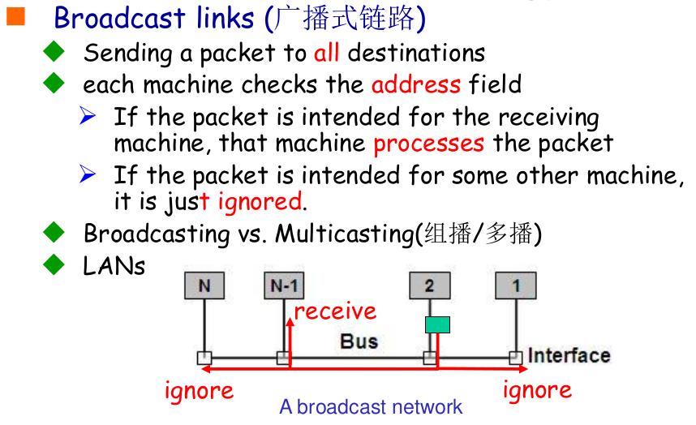
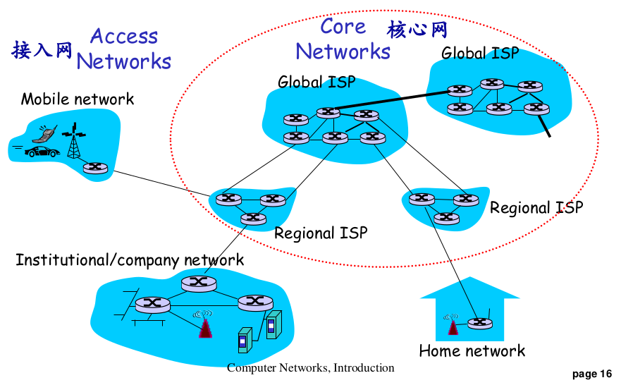

# 计算机网络课程笔记

## Chapter 1

### `PPT Contents`

教材 Computer Networks

课后 10  
实验 25，其中协议分析 10，协议设计及实现实验 15  
期中 5  
期末 60

简单介绍了 The reference model used in this book.

---

**`计算机网络的概念及应用`**

---

`What is a Computer Network?`

what can be connected  
how to connect? 直接 or 中转  
wired or wireless  
how far? LAN/WAN/Internet

**Communication**: process of transferring information from one entity to another.(wikipeida)  
 **Computer**: machine helping human beings to process information.

Distributed Systems ：A collection of independent computers appears to its users as a single coherent system（单一的系统）  
 Computer networks: A collection of autonomous(自主工作) computers interconnected by a single
technology

**Distributed System(分布式系统)**  
 A single model or paradigm that it presents to the users  
 Transparency(透明：不可见)  
 “The illusion that you have something as simple as a uniprocessor system.”  
 A well-known example：the World Wide Web,  
 everything looks like a document (Web page)

**What is a Computer Network**  
 Users are exposed to the actual machines  
 If the machines have different hardware and
different operating systems, that is fully visible to the users  
 **However**  
 Some networks or parts of them (e.g., name services) are also distributed systems  
 every distributed system relies on services provided by a computer network

Computer Network is **NOT**

- Internet, which is a network of networks, as well as the unique global network.
- WWW, which is a distributed system (or an application) running on
  top of Internet

---

`What can we do with Computer Networks?`

**分时共用的思想**

- business apps

  - resource sharing
  - client-server mode
  - communication medium among employees
    - email, VoIP(Voice over Internet Protocol), videoconferencing
    - Qos(Quality of service)  
       latency (or delay), jitter 延迟  
       bandwidth 带宽  
       bit-error-rate 错码率
  - electronic commerce
    - airlines, bookstores, shopping carts,,,

- home apps
  - Access to remote information  
     Web browsing
  - Person-to-person communication  
     Instant messaging (QQ), social networks
  - Interactive entertainment(交互式娱乐)  
     Game playing
  - Electronic commerce  
    Ubiquitous computing(普适计算)
  - peer-to-peer(P2P) model
- mobile network users
  
  - Combinations of wireless networks and mobile
    computing
  - m-commerce(移动商务)
  - Portable office(移动办公)
  - Vehicle communication: trucks, taxis, …, keeping in contact with each other and with home office
  - Meter reading (远程抄表，比如电/水表)
  - RFID(Radio-frequency identification)，可用于智能餐盘
  - Sensor networks
  - VANET(Vehicular ad hoc networks, 车载自组织网络)
- social issues

  - Politics, religion, sex
  - Eavesdropping (窃听)
  - Credit card
  - Unwanted communication (Spam, …)
  - Privacy

- compoments
  - Nodes  
    Computers/Hosts(主机)/End Systems  
    Switches/Routers (Nodes, 节点)
  - Communication Links (wired or wireless)

---

`Categories of Computer Networks`

中心化网络/去中心化网络（比如 Ad hoc, 自组织网络）

Cool **end system**  
**Links**: twisted pair $\to$ coax $\to$ fiber  
**Network Interface**: Wireless NIC / Wthernet NIC  
**Router/Switch**: Router and LAN Switch

- Computer Networks can be **categorized** in a number of ways
  - Transmission technology
    Broadcast networks vs. Point-to-point networks (more complex)
  - Network scale
    PAN, LAN, MAN, WAN
  - Position in the interconnected networks
    Access networks(接入网，比如手机接入基站) vs. Core networks

Broadcasting vs. Multicasting 区别（？查）

BY SCALE

- LAN
  - LAN (Local Area Network) is a privately owned network
  - Connecting hosts to edge router
  - Sharing ONE communication link
  - Ethernet，Wifi
- Metropolitan Area Networks(城域网)
  - A metropolitan area network based on cable TV.
  - Topology: Tree
  - Wireless: WiMax
- WAN(广域网): LAN and Subnet
  - WAN: telecommunication network that covers a broad area
  - Providing connections from a LAN to the Internet
  - Wireless: 3G, 4G, 5G
  - Communication subnet
    - Switching elements (交换设备：Router)
    - Switch or router
    - Routing decisions: Routing algorithm
    - Message Path
    - Single-path vs. Multi-path
    - Best route must be used
- Internetworks: internet（互联网）

  - internet: network of networks
  - Internet（因特网） is the unique world-wide internet

- 计算机网络的概念
  - 什么是计算机网络
    - 计算机网络 vs 分布式系统
    - 计算机网络的应用
    - 计算机网络的目标：资源共享、信息传输
    - 应用的两种模式：C/S 模式 vs P2P 模式
    - 通信服务质量 QoS: 时延、带宽和误码率
  - 计算机网络硬件组成
    - 节点（端节点、中间/交换节点）、链路
    - 有基础设施的网络 vs 自组织网络 Ad hoc
- 计算机网络分类
  - 按传输技术分
    - 点到点链路 vs 广播链路
    - 单播、广播与多播
  - 按覆盖范围分
    - PAN，LAN，MAN，WAN，互联网 internet
    - LAN: Ethernet(以太网)、WiFi
    - MAN：Cable TV, Wimax
    - WAN：通信子网、交换设备与路由交换技术
    - 互联网：网络的网络，路由器
  - 按位置分
    - 接入网 vs 骨干网

---

`Network architecture and protocols`

Layering Architecture  
 What is Protocol?  
 Protocol, service and interface

将庞大而复杂问题转化为若干较小的局部问题，采用分层的思想。

- Networks are organized as a **stack of layers** (层次栈)
  - Reduce design complexity，each one built upon the one below it
  - The purpose of each layer is to offer certain services to the higher layer while shielding those layers from the details of how the offered services are actually implemented (Encapsulating 封装)
- **Object-oriented** programming
  - A particular piece of software (or hardware) provides a service to its users, but keeps the details of its internal state and algorithms hidden from them

## Chapter 2

## Chapter 3

## Chapter 4

## Chapter 5

## Chapter 6

## Chapter 7
